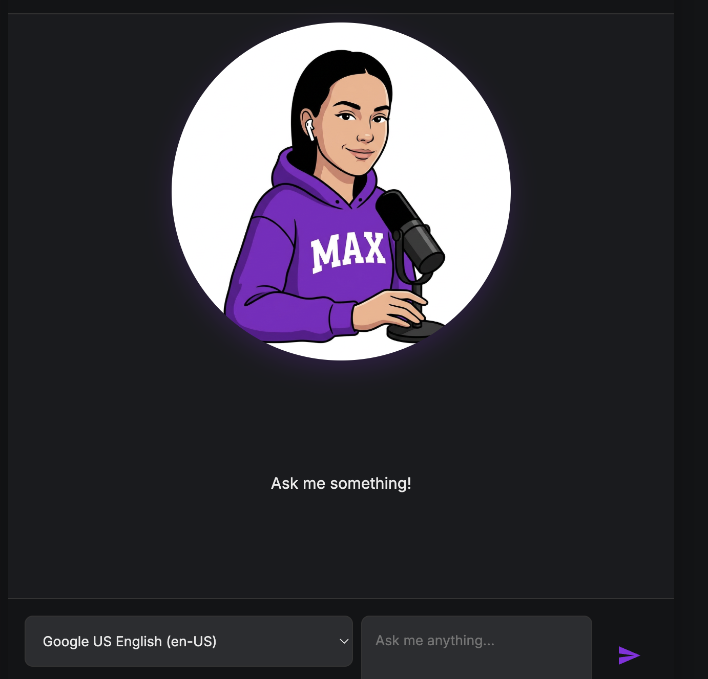
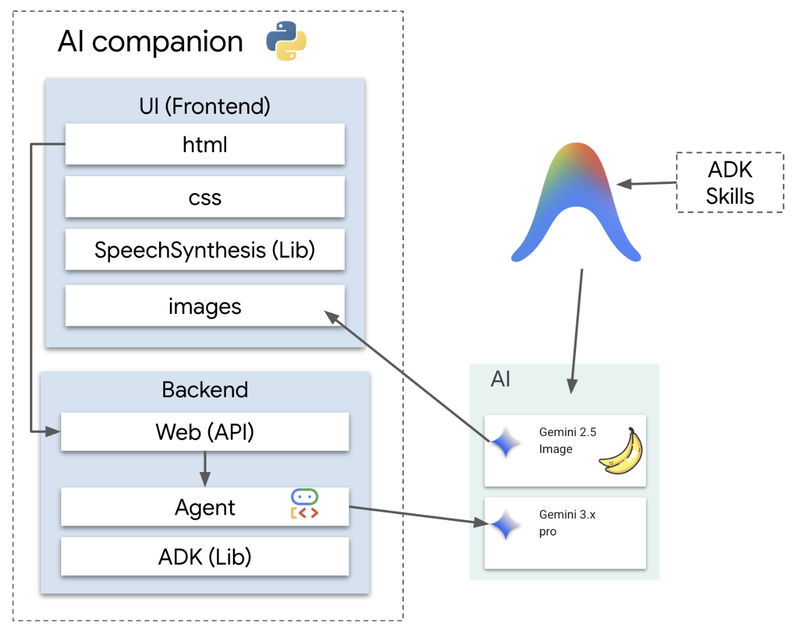

# Conversational-AIVoiceAgentADK

Meet Max — a witty, sassy AI companion that talks back, holds 
a conversation, and has opinions. Built end to end using Google 
ADK and Gemini, from character design and multi-frame lip-sync 
animation to live deployment. The goal was to ship a voice AI 
product that feels like a character, not a chatbot.

**Try it now:** [Public Live Link](https://max-companion-376593873550.us-central1.run.app/)

Max- Multilingual AI Voice Agent 

## What This Is

This is a talking AI companion with a distinct sassy personality.It 
listens to you, responds with voice, and animates in real time. 
The focus was on closing the gap between "AI that works in a demo" 
and "AI that feels like a real product experience."

---

## Architecture

The system connects a Python Flask backend to Google ADK for 
agent management, two Gemini models for conversation and 
image generation respectively, and a browser-native 
SpeechSynthesis layer on the frontend — keeping the voice 
layer lightweight and free.

---
## Key Product Decisions

**Language selection**
A dropdown lets users choose their preferred language for 
interaction. Voice AI that only works in one language excludes 
a large part of the audience, particularly relevant in India 
switching between languages mid-conversation is natural. 
This was a conscious accessibility and reach decision.

**Why a distinct personality?**
Max has a consistent witty, sarcastic personality, not a 
neutral assistant. This tests a real product challenge: how 
do you define and maintain character consistency through a 
language model? A personality makes the experience memorable 
and distinguishes it from a generic AI chat interface.

**Why voice?**
Text responses create distance. Voice adds personality and 
makes the interaction feel like a conversation rather than 
a query. SpeechSynthesis was chosen to keep it lightweight 
and free at the frontend layer without sacrificing the 
core experience.

**The lip-sync decision**
The standard approach for AI companions is two frames — mouth 
open and mouth closed. This looks robotic and breaks the sense 
of a real interaction. Instead, this project uses multiple 
frames mapped to emotional states — neutral, speaking, 
emphasising, reacting, laughing, thinking, and sarcastic. 

---

## What the Framework Handles vs What Was Built

| Built from scratch | Handled by framework |
|---|---|
| Character personality and tone | ADK session management |
| Emotion-to-frame mapping logic | Model routing and retries |
| Multi-frame lip-sync system | InMemoryRunner conversation state |
| SpeechSynthesis integration | ADK Skills interface |
| Flask API and frontend UI | Gemini API authentication |
| Character image generation prompts | Token management |

---

## Tech Stack

- Python + Flask (backend server)
- Google Agent Development Kit / ADK (agent management)
- Gemini 3.x Pro (conversation model)
- Gemini 2.5 Image (character frame generation)
- SpeechSynthesis Web API (text to voice, frontend)
- Antigravity CLI (development and image generation)
- Google Cloud Run (deployment)
- HTML + CSS (frontend)

---

## Cost

**One-time costs**
Character frame generation (via Gemini 2.5 Image) 
is a fixed build-time cost — paid once, not per conversation.
Hosting setup on Cloud Run is effectively free within 
Google Cloud's free tier for low traffic.

**Per conversation**
A typical back-and-forth exchange costs approximately 
₹0.08–₹0.25 (~$0.001–$0.003) per turn depending on 
response length. A full 10-message conversation runs 
roughly ₹0.80–₹2.50 (~$0.01–$0.03).

The dominant ongoing cost is the Gemini conversation 
model — voice synthesis runs entirely in the browser 
at zero API cost.

---

## Known Limitations

1. Conversation history resets if the Cloud Run instance 
restarts — a more advanced prod version would require persistent 
session storage or a sign-in flow to maintain continuity 
across sessions.

2. Character frames are pre-generated and static — real-time 
dynamic image generation per response would increase 
expressiveness but significantly raise cost and latency.
---

## What I Learned Building This

The most underestimated part was the coordination layer — 
getting emotion classification, frame selection, speech 
timing, and visual animation to happen together at the 
right moment required thinking about the experience as a 
whole product, not a set of independent features.

The language support decision reinforced something important: 
the people you design for are often not the people you 
initially imagine. Building in language flexibility from 
the start, rather than as an afterthought, changes who 
can actually use what you build.

The hardest thing to get right was making Max feel like 
a character rather than a feature — and that was entirely 
a product problem, not a technical one.

---
## LinkedIn Post
Checkout my [LinkedIn Post]() to see my next steps to improve this model. Watch the [Live Demo]() here.
